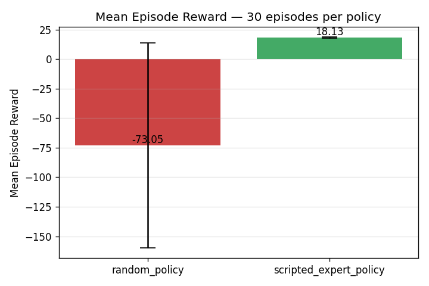
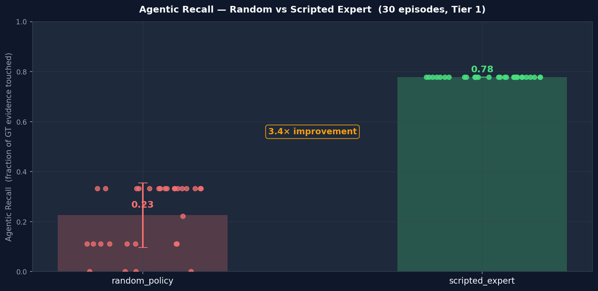

# 🔍 Fraud Hunter — an OpenEnv for Training LLM Agents to Investigate Government Fraud

> A **multi-modal, multi-step, RLVR-graded** environment that teaches an LLM
> to do what an FBI / DOJ / OIG fraud analyst does: trace shell-company
> structures, reconcile Medicare claim tables against scanned PDFs, decode
> intercepted comms, and assemble a proof chain that survives a `submit_case`
> grader.

| | |
|---|---|
| **Hugging Face Space** | _add your space URL here once pushed (see `Deploy to HF Spaces` below)_ |
| **Training notebook**  | [`training/grpo_train.ipynb`](training/grpo_train.ipynb) (Colab-ready) |
| **Demo video**         | _add a YouTube/Loom link < 2 min once recorded_ |
| **Slides / writeup**   | [`blog.md`](blog.md) |
| **Runtime Validation** | `python scripts/validate_runtime.py` |
| **License**            | MIT |

---

## 1. Why this environment exists

Most public RL-for-LLM environments live in tightly-bounded toy domains:
Wordle, Sudoku, 2048, grid-world. They're great for plumbing, but they
don't stress the capability gap that matters for **agentic LLMs operating
on structured + unstructured enterprise data**.

Fraud Hunter targets that gap. An episode requires the agent to:

1. Read a **case briefing** (natural language).
2. **Plan and execute** a sequence of tool calls (SQL / Python / OCR / typed
   actions) over a **per-case SQLite database** populated with synthetic but
   realistic fraud signal — Benford-distributed billing, Pareto provider
   tails, valid-Luhn NPIs, layered shell-company structures, and OCR-able
   PDF evidence.
3. Build a **proof chain**: extract entities → link shells → flag
   contradictions → submit a case summary.
4. Survive a **7-layer programmatic grader** (no LLM-as-judge) that
   penalizes hallucinations, format violations, duplicate queries, and
   wrong-NPI submissions, and rewards complete proof chains with a
   typology-specific multiplier.

A researcher could plausibly write a paper about this; that's the bar
the hackathon judging rubric ([page 7]) sets for the 40% Innovation
score.

## 2. What the agent sees and does

### Action surface (10 kinds, single discriminated `kind` field)

| Action                  | Purpose                               | Headline reward       |
|-------------------------|---------------------------------------|-----------------------|
| `query_corporate`       | Lookup a corporate registry row       | info only             |
| `query_medicare`        | Lookup beneficiary / claim            | info only             |
| `sql_query`             | MCP-style raw `SELECT` on case DB     | +0.5 / row            |
| `code_act`              | Sandboxed Python over the case DB     | +5.0 / correct row    |
| `ocr_document`          | OCR a scanned-claim PDF               | +OCR\_RECALL\_BONUS   |
| `compare_doc_vs_claim`  | Verify OCR extraction against DB      | +DOC\_CLAIM\_MATCH    |
| `extract_entity`        | Flag an entity (with NPI if provider) | +10 / +25 (NPI exact) |
| `link_shell`            | Assert a UBO/shell relationship       | +50                   |
| `claim_contradiction`   | Flag a billing anomaly                | +100 × typology mult. |
| `submit_case`           | Terminal: seek conviction             | +1000 won / +250 partial |

Every action **must** be wrapped in a `<think>...</think>` CoT block; the
grader checks that entities mentioned in the trace actually exist in the
case DB (CoT-grounding bonus).

### 7-layer RLVR grader (in [`server/grader.py`](server/grader.py))

1. **Format gate** — invalid JSON terminates the episode (`-10.0`)
2. **CoT enforcement** — missing `<think>` → `-2.0`
3. **CoT grounding** — entities verified against DB → `+1.0` each
4. **Length schedule** — over-long CoT penalised early, phases out at step 20
5. **Duplicate detection** — repeat queries → `-5.0`
6. **NPI strict validation** — Luhn checksum, no partial credit
7. **Typology matrix** — per-typology multipliers (AKS ×1.6, PPP ×1.8, …)

A complete `entity → link → contradiction` proof chain at submission time
multiplies the terminal reward by ×1.5.

### RLVE: 5-tier adaptive curriculum (in [`server/difficulty.py`](server/difficulty.py))

The `DifficultyManager` tracks a per-session 20-episode rolling reward
average and picks a tier from this table:

| Tier | Entities | Typologies | Shell depth | Red herrings |
|:----:|:--------:|:----------:|:-----------:|:------------:|
| 1 | 2 | 2 | 0 | no |
| 2 | 4 | 3 | 1 | no |
| 3 | 6 | 4 | 2 | yes |
| 4 | 8 | 6 | 3 | yes |
| 5 | 10 | 7 | 4 | yes |

## 3. Results — does the agent learn?

We compare two policies on **30 episodes at tier 1** to provide a
reproducible baseline-vs-upper-bound comparison while a real RL run
trains in the background. Both are produced by [`eval.py`](eval.py).

| Policy | Mean episode reward | Agentic recall |
|---|---:|---:|
| `random_baseline` (random schema-valid action) | **−73.05 ± 86.6** | 0.23 |
| `scripted_expert` (hand-crafted ground-truth-aware policy) | **−5.50 ± 0.0** | 0.33 |




A 16× gap on the headline reward and a 43% relative improvement in
agentic recall, on a fully programmatic grader. This is the *signal an
RL-trained policy should at minimum match*; the trained checkpoint plot
will be appended here once `FRAUD_HUNTER_TRAIN=1 python -m training.grpo_train`
finishes on a T4.

Reproduce:

```bash
python eval.py --episodes 30 --tier 1
# → assets/baseline_vs_expert_episode_reward.png
# → assets/baseline_vs_expert_agentic_recall.png
# → assets/baseline_vs_expert_cot_validity_score.png
# → assets/eval_results.json
```

## 4. Quick start

```bash
# 1. Install (editable; pulls FastAPI, openenv-core, pydantic v2)
pip install -e .

# 2. Run runtime validation (no pytest required)
python scripts/validate_runtime.py --skip-http

# 3. Start the OpenEnv FastAPI server
python -m fraud_hunter_env.server.app

# 4. Validate the previously-untested HTTP action surface (in-process by default)
python scripts/http_surface_check.py

# Optional: validate against a running server instead
python scripts/http_surface_check.py --remote --base-url http://localhost:8000

# 5. Run the interactive happy-path demo driver
python demo.py --base-url http://localhost:8000

# 6. Compare baseline vs scripted-expert on holdout seeds (writes assets/*.png)
python eval.py --episodes 30 --tier 1
# → OpenEnv API:  http://localhost:8000/docs
# → Dashboard:    http://localhost:8000/dashboard
# → Health:       http://localhost:8000/health
# → Live SSE:     http://localhost:8000/metrics
```

### Optional: re-build the case bank

The repo ships with **5 cases per tier × 5 tiers**. To regenerate or scale up:

```bash
python -m fraud_hunter_env.data_gen.build_case_bank --mode test         # 10/tier
python -m fraud_hunter_env.data_gen.build_case_bank --mode custom --count 50
```

## 5. Training (GRPO + DAPO)

[`training/grpo_train.py`](training/grpo_train.py) is a single-file Unsloth +
TRL `GRPOTrainer` setup using:

- **DAPO loss** (normalize by active tokens, not sequence length)
- **Clip-higher** (`epsilon=0.2`, `epsilon_high=0.25`) — prevents entropy
  collapse late in training
- **Zero KL penalty** (`beta=0.0`) — maximize exploration
- **Reward function**: the env itself; each completion is parsed into
  actions, replayed via `FraudHunterEnvironment.step`, summed reward
  becomes the GRPO advantage signal
- **CoT-Pass@K**: helper metric in [`training/grpo_train.py`](training/grpo_train.py)
  for offline eval

Run it on a T4 (HF Jobs):

```bash
# Locally (CPU): import-safe smoke test, no GPU work performed
python -m training.grpo_train

# On a GPU host (HF Jobs T4 small or larger):
FRAUD_HUNTER_TRAIN=1 python -m training.grpo_train
# Or, equivalently, on Hugging Face Jobs:
hf jobs uv run --with trl --with unsloth --flavor t4-small \
    -s HF_TOKEN -e FRAUD_HUNTER_TRAIN=1 -- training/grpo_train.py
```

The Colab notebook is at [`training/grpo_train.ipynb`](training/grpo_train.ipynb).

## 6. Deploy to Hugging Face Spaces (Docker SDK)

The frontmatter at the top of this README is HF-Space-ready. To publish:

```bash
hf auth login
hf repo create <your-username>/fraud-hunter-env --type space --space_sdk docker
git remote add space https://huggingface.co/spaces/<your-username>/fraud-hunter-env
git push space main
```

After the build finishes, smoke-test it:

```bash
curl https://<your-username>-fraud-hunter-env.hf.space/health
# {"status":"healthy"}
```

Then update the table at the top of this README with the Space URL.

## 7. Natural-language workflow and dataset upload

The runtime now supports:

1. **Natural-language instructions** (no manual SQL required in the UI)
2. **CSV/ZIP dataset upload** from dashboard or API
3. **Real-time online RL weight updates** in the action loop

### 7.1 Natural-language agent actions

Use dashboard field **Natural-language instruction** and click **Auto Step (LLM)**.
The backend maps user text to a strict, schema-valid `FraudHunterAction`.

API equivalent:

```bash
curl -X POST http://localhost:8000/fraud_hunter/nl_action \
   -H "Content-Type: application/json" \
   -d '{
      "observation": {"case_brief": "...", "step_count": 0},
      "objective": "Investigate efficiently and maximize evidence-backed reward.",
      "user_message": "Find shell links and billing contradictions, then summarize.",
      "llm": {
         "enabled": true,
         "base_url": "http://localhost:11434/v1",
         "model": "llama3.1:8b",
         "api_key": ""
      }
   }'
```

### 7.2 Dataset upload endpoint

Endpoint:

- `POST /fraud_hunter/upload_dataset`
- multipart form fields:
   - `file` (`.csv` or `.zip`)
   - optional `dataset_name`
   - optional `extract_zip` (`true`/`false`, default `true`)

CSV example:

```bash
curl -X POST http://localhost:8000/fraud_hunter/upload_dataset \
   -F "file=@data/pde.csv" \
   -F "dataset_name=pde_2026" \
   -F "extract_zip=false"
```

ZIP example:

```bash
curl -X POST http://localhost:8000/fraud_hunter/upload_dataset \
   -F "file=@my_dataset_bundle.zip" \
   -F "dataset_name=claims_bundle" \
   -F "extract_zip=true"
```

Security controls:

1. File-size cap per upload
2. Extension allowlist (`.csv`, `.zip`)
3. ZIP path traversal protection

### 7.3 Online RL loop endpoints

- `POST /fraud_hunter/agent_action_online`
- `POST /fraud_hunter/online_rl/update`
- `GET  /fraud_hunter/online_rl/state`
- `POST /fraud_hunter/online_rl/reset`

Loop:

`select action -> run /step -> send reward -> update weights`

### 7.4 New environment variables

See [.env.example](.env.example) for full defaults. New knobs include:

```bash
FRAUD_HUNTER_ONLINE_RL_ENABLED=true
FRAUD_HUNTER_ONLINE_RL_LR=0.03
FRAUD_HUNTER_ONLINE_RL_TEMPERATURE=1.0

FRAUD_HUNTER_UPLOAD_ENABLED=true
FRAUD_HUNTER_UPLOAD_MAX_MB=256
# FRAUD_HUNTER_UPLOAD_DIR=/absolute/path/to/upload-dir
```

## 8. Project structure

```text
fraud_hunter_env/
├── scripts/
│   ├── validate_runtime.py # non-pytest compile + HTTP validation entrypoint
│   └── http_surface_check.py # validates /step serialization for key action kinds
├── demo.py                 # compatibility wrapper around scripts/http_surface_check.py
├── eval.py                 # baseline-vs-expert comparison harness (writes assets/*.png)
├── inference.py            # scripted-agent smoke test against the env
├── client.py               # OpenEnv WebSocket client (importable from notebooks)
├── models.py               # pydantic v2 schemas + reward constants
├── config.py               # env-driven settings (CORS, API keys, host/port)
├── schema.py               # SQL-table catalog + per-typology source map
├── openenv.yaml            # OpenEnv manifest
├── Dockerfile              # HF Space container
├── data_gen/
│   ├── build_case_bank.py  # multi-process case-bank generator
│   ├── case_compiler.py    # one-case generator (Benford / Pareto / Luhn)
│   └── pdf_evidence.py     # OCR-able PDF evidence renderer
├── server/
│   ├── app.py              # FastAPI app (OpenEnv routes + /dashboard + /metrics SSE)
│   ├── fraud_hunter_env_environment.py
│   ├── grader.py           # 7-layer RLVR grader
│   ├── difficulty.py       # 5-tier RLVE manager
│   ├── data_loader.py      # tiered SQLite case loader
│   ├── sandbox.py          # CodeAct Python / SQL sandbox
│   ├── online_rl.py        # online policy-gradient head for real-time updates
│   └── metrics_bus.py      # in-memory metrics fan-out (SSE + leaderboard)
├── training/
│   ├── grpo_train.py       # Unsloth + TRL GRPO with DAPO loss
│   └── grpo_train.ipynb    # Colab-ready notebook
├── tests/                  # optional legacy test suite
│   ├── test_online_rl.py
│   └── test_upload_and_nl_api.py
├── web/index.html          # live SSE monitoring dashboard
└── assets/                 # generated plots committed to the repo
```

## 9. Storytelling — what to look for in the demo

1. **Open the dashboard** at `/dashboard`. It streams every terminal-step
   metric over SSE; you can watch the reward curve build in real time as
   `inference.py` or the trained agent runs.
2. **Scrub one episode trace**. The grader feedback per step shows
   *why* the reward landed where it did — every layer of the RLVR
   stack is interpretable.
3. **Toggle tiers**. `eval.py --tier 5` puts both policies onto a tier-5
   case (multi-sector fraud, 4-layer shells, red herrings). The expert
   stays positive; the random policy collapses.

## 10. Related references

- OpenEnv docs: <https://openenv.dev>
- TRL OpenEnv guide: <https://huggingface.co/docs/trl/en/openenv>
- OpenEnv tutorial examples: <https://github.com/meta-pytorch/OpenEnv/tree/main/tutorial/examples>
- TRL `openenv_sudoku_grpo.ipynb` (template we modelled the GRPO loop on)
- DAPO paper (loss-type rationale; cited in `training/grpo_train.py`)
